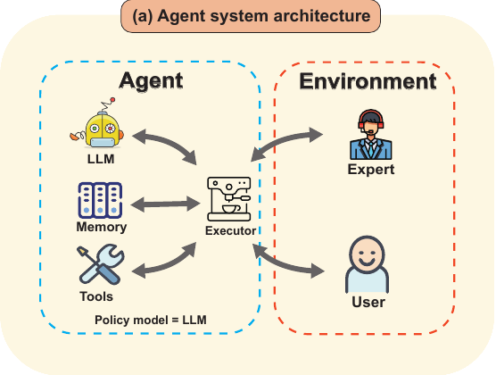
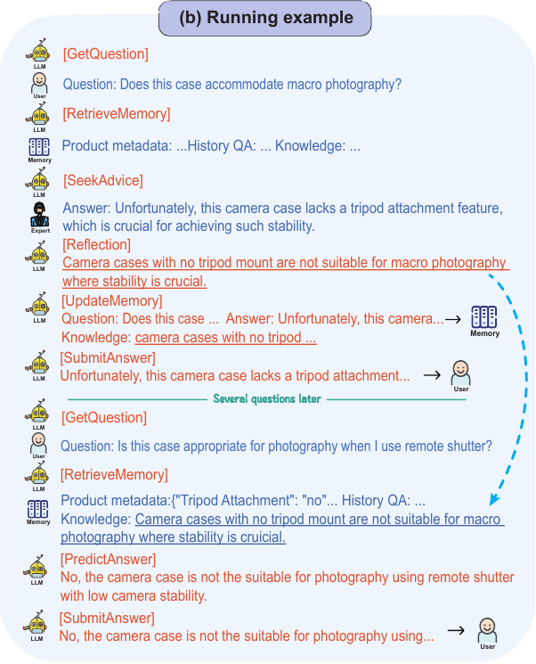

Artificial intelligence (AI) agents have come a long way from simply answering questions. Imagine a customer asking, "Will this camera case work for macro photography?" A good AI might say "no" based on product details, but a great AI would explain *why* it's unsuitable, consult past knowledge, seek expert advice if necessary, and learn for next time. At NeurIPS 2024, researchers introduced AGILE (AGent that Interacts and Learns from Environments), a groundbreaking framework that teaches AI agents to think, adapt, and grow.

Let’s explore how AGILE works and what makes it such a leap forward in AI decision-making.

## **The Challenge: Teaching AI to Think Smarter**

AI agents are everywhere, from virtual assistants to chatbots, but they still have their limits. Many struggle with:

- **Reasoning Through Complexity:** How do you reason through multiple steps? For example, recommending a laptop requires balancing specs, user preferences, and budget.
- **Using Tools Effectively:** Imagine needing to query a database for specific compatibility details.
- **Adapting to New Problems:** Most AI doesn’t learn from its mistakes or new experiences.

Existing approaches tend to treat these problems in isolation. AGILE changes the game by unifying these capabilities into a seamless system.

## **The AGILE Framework: A Unified Approach**

AGILE brings four main components together:

1. **LLM as Policy Model:** Think of the Large Language Model (LLM) as the agent’s decision-maker, generating step-by-step actions.
2. **Memory:** The agent stores and retrieves past experiences, allowing it to learn over time.
3. **Tools:** These are external helpers, like search engines or databases, which the agent can use to gather additional information.
4. **Executor:** This module ensures that all the pieces work together seamlessly.

### **How It Works: Explaining the Process**

At the heart of AGILE’s functionality lies a carefully coordinated process. Whenever a user asks a question, the Large Language Model (LLM) steps in as the decision-maker, analyzing the query and deciding the next steps. The LLM can reach into its **Memory**, where previous interactions and knowledge are stored, to see if similar questions have been tackled before. If the memory doesn’t hold the answer, the agent then uses its **Tools** to fetch external data—for example, querying a database or consulting a search engine. If the question proves especially challenging, AGILE can even activate its "Seek Advice" capability, consulting human experts for clarification. Once all the pieces come together, the agent synthesizes an answer, reflects on the process, and updates its memory to ensure it’s better prepared for similar tasks in the future.

### **Learning from Experts: AGILE’s Secret Weapon**

One standout feature of AGILE is its ability to proactively seek **human advice.** Unlike traditional systems that only react, AGILE asks for help when its confidence is low. For instance:

- If the agent encounters an unfamiliar medical term during a consultation, it can ask a doctor (expert) for clarification.
- Once it gets an answer, it reflects on the new information and integrates it into its memory.

This iterative learning process ensures AGILE becomes smarter over time, reducing its dependence on experts in the future while also reducing the prevalent problem of AI hallucination.

## **Real-World Testing: How AGILE Excels**

Testing AGILE wasn’t just about theoretical performance; it was about seeing how it handles the real world. Researchers threw it into three tough challenges:

In **ProductQA**, AGILE tackled over 88,000 customer questions, ranging from "What’s the battery life of this laptop?" to "Which headphones are best for gaming?" Unlike traditional models, it didn’t just provide facts. It reasoned through user preferences, balanced specs, and even explained why it made its recommendations. One memorable moment? Helping a user decide between two waterproof cameras by analyzing not just features but also reviews and use cases.

**MedMCQA** tested AGILE’s chops in medical knowledge, with questions pulled from medical school entrance exams. It wasn’t just about knowing answers; AGILE needed to think like a doctor—reasoning through symptoms, consulting past cases in memory, and confidently deciding when to seek expert advice. Over a third of the time, that advice helped AGILE improve its answers, boosting accuracy by an incredible 31.8% over its base model.

And then there was **HotPotQA**, a multi-hop reasoning challenge. Here, AGILE had to connect the dots across multiple sources. For example, when asked, "Was the director of the highest-grossing film of 1997 born before 1950?" AGILE first identified the film ("Titanic"), found its director (James Cameron), and calculated his birth year—all while making it look effortless. The result? A 40% improvement over other baselines.

## **Why AGILE Matters**

AGILE isn’t just another technical innovation; it’s a window into what smarter, more adaptable AI systems can achieve. Think about shopping assistants that don’t just spit out generic product suggestions but learn your preferences over time, offering recommendations that feel tailored and thoughtful. Or imagine a healthcare advisor capable of not only diagnosing conditions but seeking expert advice when uncertain, ensuring every suggestion it makes is reliable and accurate. For researchers, engineers, or students, AGILE can be a partner in solving multi-step problems, guiding them through complex tasks with clarity and adaptability.

By weaving these capabilities together, AGILE is redefining how AI interacts with the world—and how it learns to do better every time.

## **The Road Ahead: What’s Next for AGILE?**

The current capabilities of AGILE are already impressive, but its potential for growth opens up exciting possibilities-

- **Multi-modal Skills:** Allowing AGILE to process not just text but also images, audio, and even videos, enabling it to tackle more complex, real-world tasks.
- **Advanced Collaboration:** Developing capabilities for AGILE to work seamlessly alongside human teams or other AI systems, sharing tasks and adapting dynamically to shared goals.
- **Cultural Awareness:** Training AGILE to incorporate cultural and ethical contexts in its reasoning, a crucial skill for applications like global business or legal advisories.
- **Continuous Learning:** Enhancing AGILE to evolve over time by learning from every interaction, ensuring it adapts to changing environments and user needs.

## **Closing Thoughts: A New Era for AI**

AGILE isn’t just another AI framework; it’s a glimpse into what truly intelligent agents could look like. By uniting reasoning, memory, tools, and adaptability, it sets a new standard for what AI can achieve. Whether it’s helping you choose the perfect product, assist with medical decisions, or solve complex research problems, AGILE doesn’t just promise answers—it promises growth.

The future of AI isn’t just smarter. It’s AGILE.

---

**Read the full paper here:**  
 Feng, P., He, Y., Huang, G., Lin, Y., Zhang, H., Zhang, Y., & Li, H. (2024). AGILE: A Novel Framework of LLM Agents. [arXiv preprint arXiv:2405.14751.](https://doi.org/10.48550/arXiv.2405.14751)
